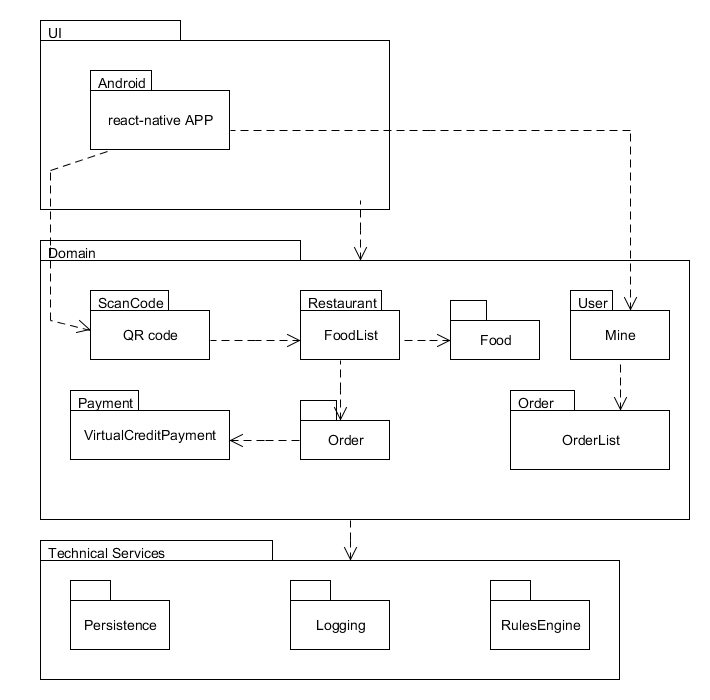
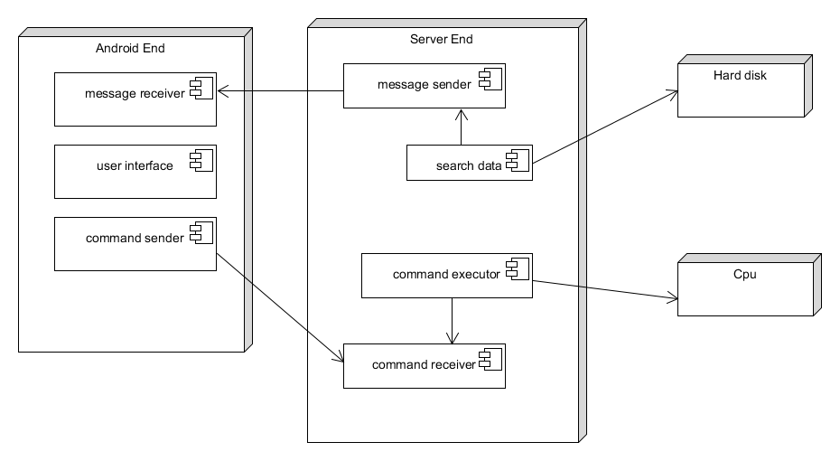

### 软件架构文档
#### 架构问题
> 暂未确定
#### 解决方案说明
##### 解决方案概要
> 使用服务查找以实现其位置的透明性，使用本地服务中的部分复制以实现从远程到本地的故障转移。远程服务失败后由本地提供一些基本的功能。

##### 因素
>* 从远程服务失败中的健壮恢复（库存、扫码错误等）。
>* 从远程产品（例如描述和定价）数据库访问失败中的健壮恢复。
##### 解决方案-前端
> 暂未确定
##### 解决方案-服务端

> 当前端与远程服务器同步数据失败时，前端可以提供一些重要的远程服务的本地实现，后端实现前端的数据库检测，更新同步，或者使用智能代理。该实现通常只具备简化的和受限的行为。例如:

>* 本地提供点餐CA凭证生成服务，用户通过扫码进入本地的点餐的列表，出示订单凭证即可现场预定。

>* 本地产品信息数据库缓存了部分最常用的产品信息，在本地设定扫码后餐桌的位置，重新连接时后端将进行库存的更新。

>* 为了满足尽快重新连接远程服务的质量场景。对该服务使用智能代理对象，即在每个服务调用时，测试远程服务是否恢复。如果可能则重定向这些调用。

>* 参见“第三方服务的适应性”技术备忘录。其中记录了本解决方案的可适应性方面，因为远程服务的实现对于每个安装都可能有所不同。
#### 逻辑视图

#### 物理视图
