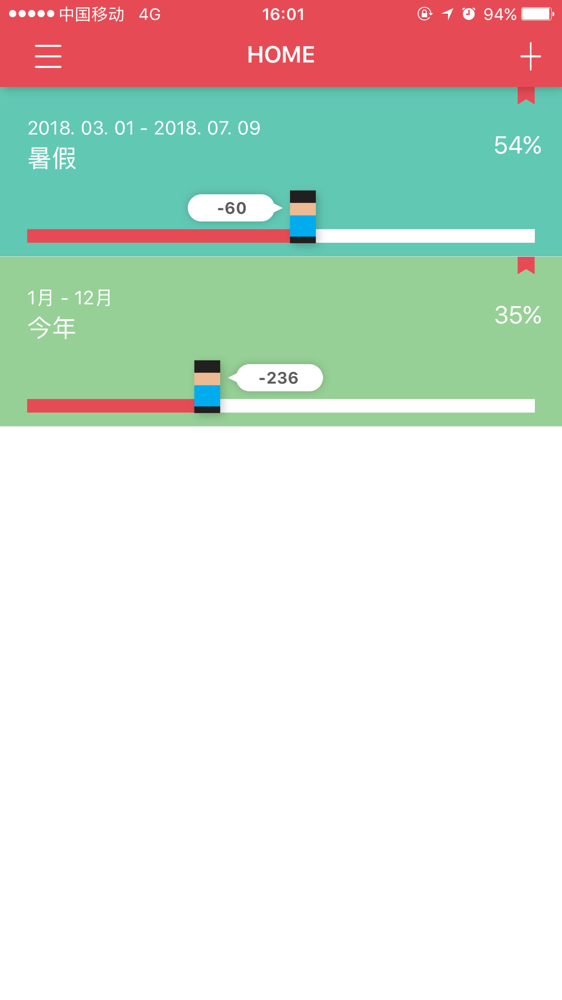
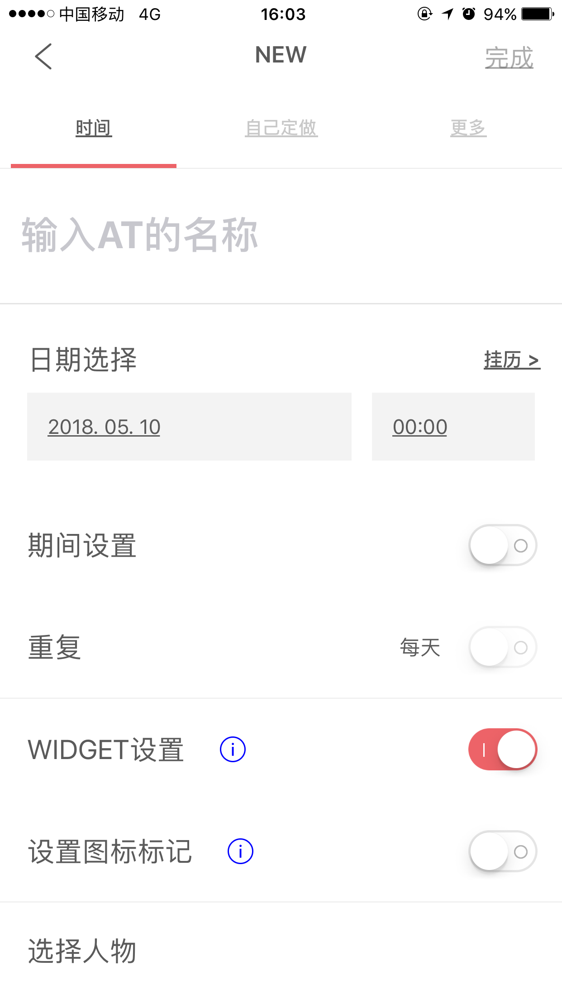
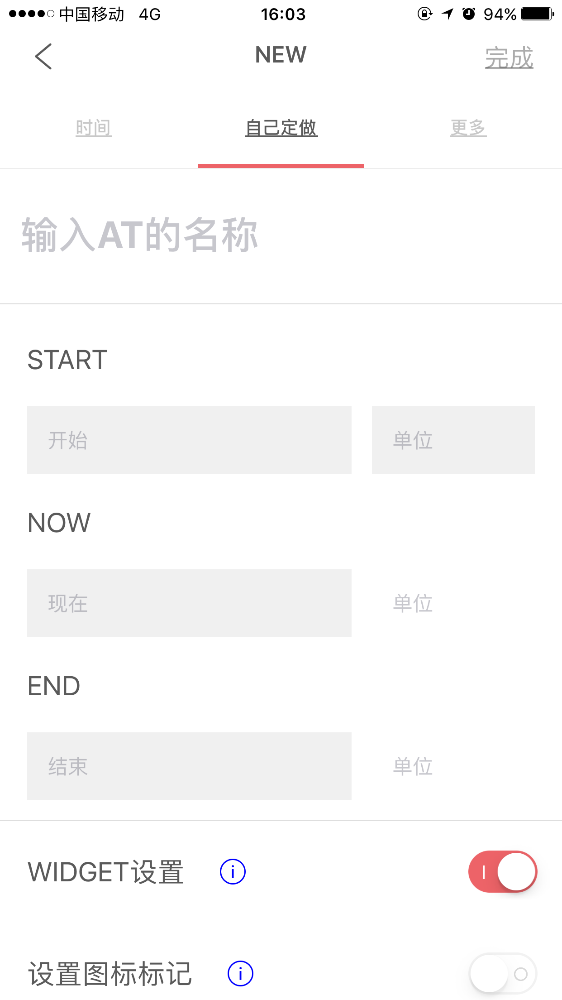
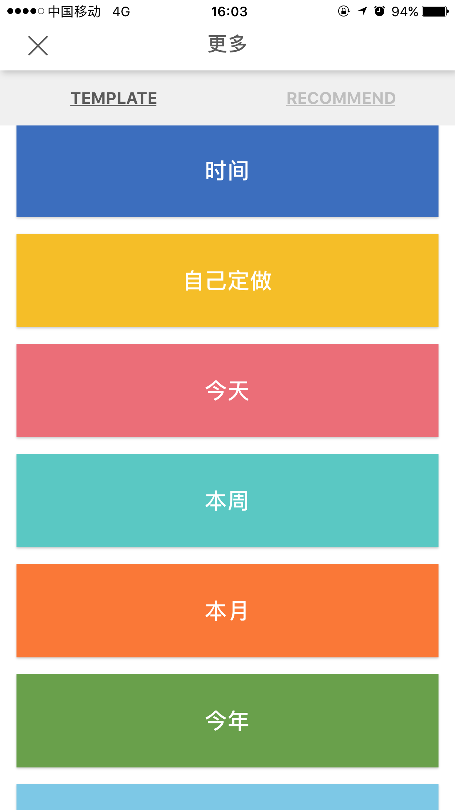
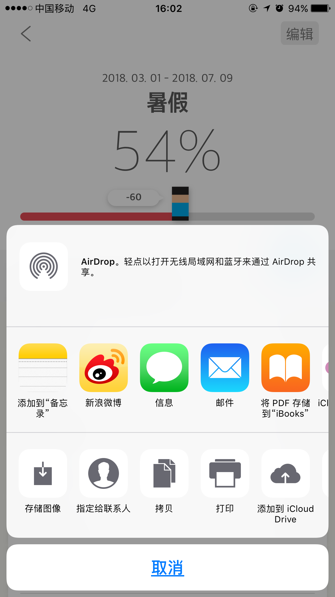
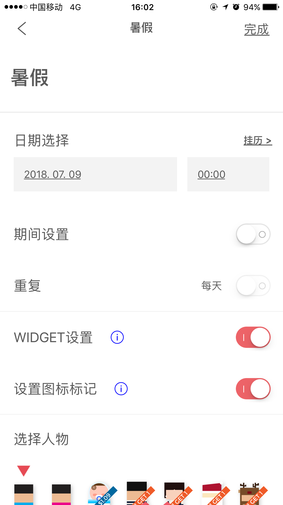
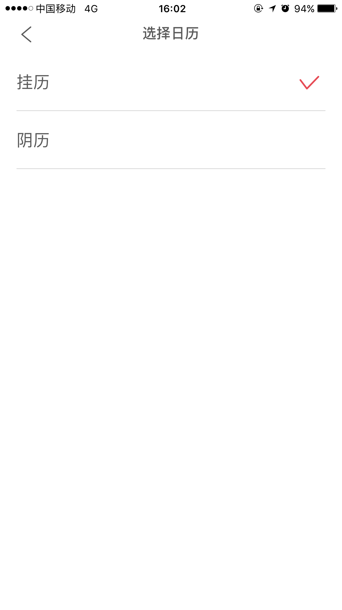
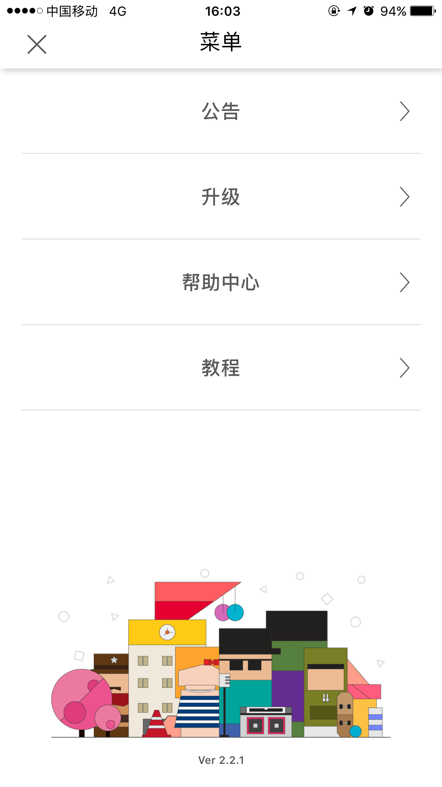

## AT应用说明文档 
### 应用说明
> AT是一款帮助使用者进行任务和日程管理的TODO类APP。和其他的TODO类APP相比，AT提供了更为直观的可视化展示
### 首页
>- AT的首页显示了目前**所有的日程**。
>- 每一个**日程项**包含**起始时间**，**截止时间**，**进度百分比**，**任务名**，以及一个**可视化进度条**
>- 点击右上的**加号**可以**添加新任务**
>- 点击左上的**菜单**可以查看**APP的相关信息**
>- 点击**日程项**可以对该日程项进行**编辑修改**

### 添加新任务
>点击首页的**加号**后进入**添加新任务**的页面。
> 添加方式分为3种：**时间，自己做，更多**
#### 时间
>- 时间模式下，可以输入日程名，确定起始时间，截止时间，是否重复，是否添加到widget，是否设置人物图标

>- 还可以选择对应的人物图标，部分图标需要购买

#### 自己做
>- 自己做模式下编辑方式和时间模型类似，只是自由度更高

#### 更多
>- 更多下，APP会提供一些模板和推荐

>- 模板

>- 推荐

### 编辑任务
> 点击首页的**日程项**后进入**日程的详情页面**

> 点击分享后可以分享日程

> 点击编辑后可以修改日程的信息

>- 可以修改日程名，修改起始时间，截止时间，是否重复，是否添加到widget，是否设置人物图标，以及更换人物图标

> 点击挂历后可以切换日历类别，包含日历和阴历

> 勾选了期间设置后，可以设置日期期间 

### APP信息
> 点击首页的**菜单**可以查看**APP的相关信息**

